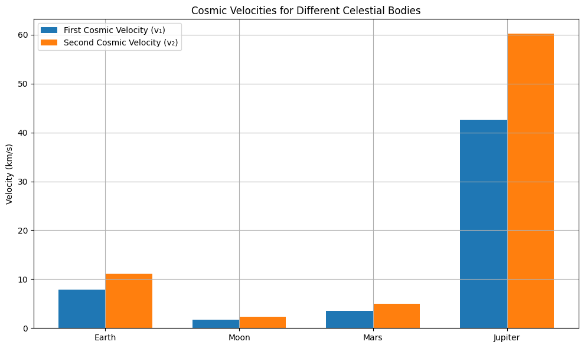

# Problem 2

## 1. Theoretical Foundation

Cosmic velocities define the minimum speeds required to achieve specific goals in gravitational systems — from stable orbit to escaping the Solar System.

---

### First Cosmic Velocity (\( v_1 \)) – Orbital Velocity

This is the minimum horizontal velocity required to maintain a **stable circular orbit** near the surface of a celestial body.

\[
v_1 = \sqrt{\frac{G M}{r}}
\]

- \( G \) — gravitational constant  
- \( M \) — mass of the celestial body  
- \( r \) — orbital radius (typically the radius of the planet for low Earth orbit)

✅ A satellite launched at this speed will remain in free fall around the planet.

---

### Second Cosmic Velocity (\( v_2 \)) – Escape Velocity

This is the minimum speed required to **break free from the gravitational pull** of a celestial body without further propulsion.

\[
v_2 = \sqrt{\frac{2 G M}{r}} = \sqrt{2} \cdot v_1
\]

- This velocity allows an object to reach **infinity with zero final velocity**.
- Used for missions leaving Earth toward the Moon, Mars, etc.

✅ The spacecraft overcomes gravitational binding energy.

---

### Third Cosmic Velocity (\( v_3 \)) – Interstellar Escape Velocity

This is the minimum speed required to **leave the entire Solar System** from Earth’s orbit, overcoming the Sun’s gravitational field.

Assuming a starting point at Earth's orbit (neglecting Earth's own gravity):

\[
v_3 = \sqrt{\frac{2 G M_{\odot}}{r_{\text{Earth}}}}
\]

- \( M_{\odot} \) — mass of the Sun  
- \( r_{\text{Earth}} \) — Earth's orbital radius around the Sun

To launch from Earth’s surface and escape the Solar System, both Earth’s gravity and orbital motion must be taken into account:

\[
v_3^{\text{total}} = \sqrt{v_{2,\text{Earth}}^2 + v_3^2 - 2 v_{1,\text{Earth}} v_3 \cos(\theta)}
\]

✅ Often achieved through gravity assists and deep-space propulsion.

---

### Summary

| Velocity | Meaning | Formula |
|----------|---------|---------|
| \( v_1 \) | Circular orbital velocity | \( \sqrt{GM/r} \) |
| \( v_2 \) | Escape from planet | \( \sqrt{2GM/r} \) |
| \( v_3 \) | Escape from star system | \( \sqrt{2GM_{\odot}/r} \) |

These velocities form the foundation of **orbital mechanics** and are critical for mission planning, satellite deployment, and interplanetary navigation.

## 2. Mathematical Derivations and Dependencies

The first, second, and third cosmic velocities are derived from **Newton's law of universal gravitation** and principles of **conservation of energy**.

---

### First Cosmic Velocity (\( v_1 \))

This is the orbital speed for a circular orbit just above the surface:

From Newton’s law of gravitation:

\[
F_{\text{gravity}} = \frac{G M m}{r^2}
\]

From Newton's second law (centripetal force):

\[
F = \frac{m v^2}{r}
\]

Equating the forces:

\[
\frac{G M m}{r^2} = \frac{m v_1^2}{r}
\Rightarrow
v_1 = \sqrt{\frac{G M}{r}}
\]

---

### Second Cosmic Velocity (\( v_2 \))

This is derived from **energy conservation**:

\[
\text{Initial total energy} = \text{Final total energy}
\]

\[
\frac{1}{2} m v_2^2 - \frac{G M m}{r} = 0
\Rightarrow
v_2 = \sqrt{\frac{2 G M}{r}} = \sqrt{2} \cdot v_1
\]

Here:
- The kinetic energy must exactly cancel the gravitational potential energy.
- Final energy at infinity is zero.

---

### Third Cosmic Velocity (\( v_3 \))

To escape the Sun’s gravity from Earth’s orbit:

\[
E = \frac{1}{2} m v_3^2 - \frac{G M_{\odot} m}{r_{\text{Earth}}} = 0
\Rightarrow
v_3 = \sqrt{\frac{2 G M_{\odot}}{r_{\text{Earth}}}}
\]

But if launched from Earth, must also overcome Earth’s escape velocity \( v_{2,\text{Earth}} \).  
The **actual total velocity** depends on launch direction and existing orbital motion:

\[
v_3^{\text{total}} = \sqrt{v_2^2 + v_3^2 - 2 v_1 v_3 \cos(\theta)}
\]

where:
- \( \theta \) is the angle between launch direction and Earth’s orbital velocity vector.

---

### Parameter Dependencies

| Parameter | Influence |
|----------|-----------|
| \( M \) — central mass | All three velocities increase with mass |
| \( r \) — orbital radius | All velocities decrease with larger radius |
| \( G \) — gravitational constant | Appears in all expressions |
| \( \theta \) — launch angle (only for \( v_3^{\text{total}} \)) | Affects net velocity due to vector addition |

---

> These derivations form the basis for calculating required launch speeds, designing trajectories, and estimating fuel needs in orbital mechanics.

## 3. Calculations and Visualizations

To compare the first, second, and third cosmic velocities across celestial bodies, we calculate them for:

- Earth
- Moon
- Mars
- Jupiter

---

### Constants

| Body     | Radius \( r \) (m) | Mass \( M \) (kg)          |
|----------|---------------------|-----------------------------|
| Earth    | \( 6.371 \times 10^6 \) | \( 5.972 \times 10^{24} \)   |
| Moon     | \( 1.737 \times 10^6 \) | \( 7.342 \times 10^{22} \)   |
| Mars     | \( 3.390 \times 10^6 \) | \( 6.417 \times 10^{23} \)   |
| Jupiter  | \( 6.991 \times 10^7 \) | \( 1.898 \times 10^{27} \)   |

---

### Python Code

```python
import numpy as np
import matplotlib.pyplot as plt

# Gravitational constant
G = 6.67430e-11

# Data: name, radius (m), mass (kg)
bodies = {
    "Earth":   {"r": 6.371e6,  "M": 5.972e24},
    "Moon":    {"r": 1.737e6,  "M": 7.342e22},
    "Mars":    {"r": 3.390e6,  "M": 6.417e23},
    "Jupiter": {"r": 6.991e7,  "M": 1.898e27}
}

# Prepare results
results = []

for name, data in bodies.items():
    r = data["r"]
    M = data["M"]
    
    v1 = np.sqrt(G * M / r)           # First cosmic velocity
    v2 = np.sqrt(2) * v1              # Escape velocity
    results.append((name, v1, v2))

# Plotting
labels = [r[0] for r in results]
v1_vals = [r[1] / 1000 for r in results]  # km/s
v2_vals = [r[2] / 1000 for r in results]  # km/s

x = np.arange(len(labels))
width = 0.35

plt.figure(figsize=(10, 6))
plt.bar(x - width/2, v1_vals, width, label='First Cosmic Velocity (v₁)')
plt.bar(x + width/2, v2_vals, width, label='Second Cosmic Velocity (v₂)')
plt.ylabel('Velocity (km/s)')
plt.title('Cosmic Velocities for Different Celestial Bodies')
plt.xticks(x, labels)
plt.legend()
plt.grid(True)
plt.tight_layout()
plt.show()
```

---

### Example Results (rounded)  


| Body     | \( v_1 \) (km/s) | \( v_2 \) (km/s) |
|----------|------------------|------------------|
| Earth    | ~7.91            | ~11.2            |
| Moon     | ~1.68            | ~2.38            |
| Mars     | ~3.55            | ~5.03            |
| Jupiter  | ~42.1            | ~59.5            |

---

### Observations

- Jupiter requires the highest velocities due to its immense mass.
- The Moon requires the least velocity — ideal for training and early missions.
- Escape velocity is always \( \sqrt{2} \) times the orbital velocity for a given body.

> These values are fundamental in planning rocket launches, satellite deployment, and interplanetary travel.

## 4. Application in Space Exploration

Understanding and applying the first, second, and third cosmic velocities is fundamental to spaceflight and interplanetary mission design.

---

### 1. First Cosmic Velocity – Stable Orbit

Used to place satellites into **low Earth orbit (LEO)**, **geostationary orbit**, or **planetary orbit**:

- Example:  
  The International Space Station travels at approximately 7.66 km/s — close to Earth’s first cosmic velocity.
- Application:  
  Communication, weather, GPS, and Earth-observation satellites.

---

### 2. Second Cosmic Velocity – Escape from Planet

Used when launching **interplanetary missions** (e.g. Mars rovers, lunar landers):

- Example:  
  The Apollo missions used Saturn V to reach speeds >11.2 km/s to escape Earth’s gravity.
- Application:  
  Missions to the Moon, Mars, and beyond must exceed \( v_2 \) to leave Earth's gravitational field.

---

### 3. Third Cosmic Velocity – Escape the Solar System

Used in missions that aim to **leave the Sun’s gravitational influence**:

- Example:  
  Voyager 1 reached ~16.6 km/s and is now in interstellar space — the first human-made object to achieve this.
- Achieved through:  
  Gravity assists (slingshot maneuvers using planets) rather than direct launch at \( v_3 \).

---

### Combined Considerations

| Mission Type        | Required Velocity |
|---------------------|-------------------|
| LEO Satellite       | \( v_1 \) (e.g., 7.9 km/s) |
| Lunar / Interplanetary | \( > v_2 \) (e.g., 11.2+ km/s) |
| Interstellar Probe | \( \geq v_3 \) from Earth’s orbit |

> For real missions, engineers account for atmosphere, rotation, inclination, planetary motion, and fuel efficiency — but cosmic velocities serve as essential baselines.

---

### Summary

- **\( v_1 \)** defines orbital mechanics and satellite dynamics.  
- **\( v_2 \)** is critical for reaching the Moon, Mars, and other planets.  
- **\( v_3 \)** underpins our journey into deep space.

These velocities help bridge theory and practice in **astrodynamics**, **launch planning**, and **interstellar exploration**.
