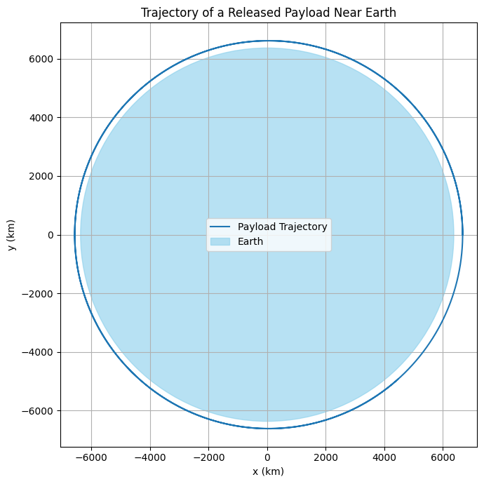
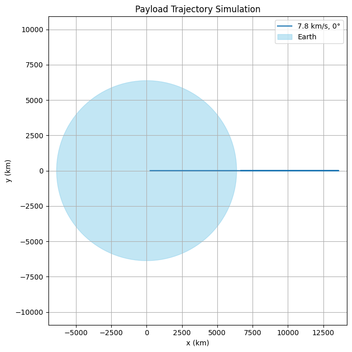
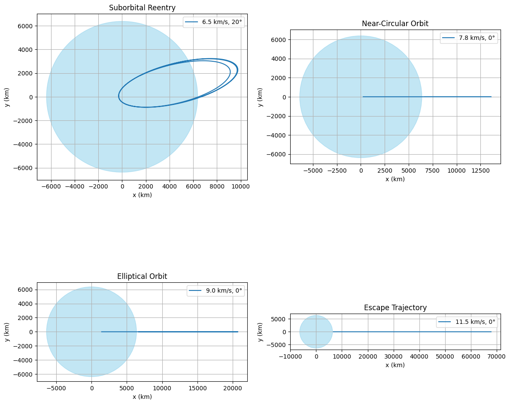

# Problem 3

## 1. Theoretical Foundation

The trajectory of a freely released payload near Earth depends on its initial speed, direction, and altitude — all governed by Newtonian gravity and conservation laws.

---

### Classification of Trajectories

The shape of the payload’s orbit depends on its **specific mechanical energy** \( \varepsilon \):

\[
\varepsilon = \frac{v^2}{2} - \frac{G M}{r}
\]

where:
- \( v \) is the initial velocity of the payload,
- \( r \) is the distance from Earth’s center,
- \( G \) is the gravitational constant,
- \( M \) is Earth’s mass.

---

### Types of Trajectories

| Trajectory Type     | Condition on \( \varepsilon \)       | Shape         |
|---------------------|---------------------------------------|---------------|
| Bound (orbital)     | \( \varepsilon < 0 \)                 | Elliptical    |
| Escape              | \( \varepsilon = 0 \)                 | Parabolic     |
| Unbound             | \( \varepsilon > 0 \)                 | Hyperbolic    |

- **Elliptical**: Object is captured by Earth and follows a closed orbit.  
- **Parabolic**: Object escapes Earth with exactly zero residual speed at infinity.  
- **Hyperbolic**: Object escapes with non-zero speed — e.g., interplanetary or interstellar ejection.

---

### Relation to Orbital Velocity

Let \( v_1 = \sqrt{\frac{G M}{r}} \) — the circular orbital velocity. Then:

- If \( v < v_1 \): suborbital fall back to Earth  
- If \( v = v_1 \): circular orbit  
- If \( v_1 < v < v_2 \): elliptical orbit  
- If \( v = v_2 = \sqrt{2} v_1 \): parabolic escape  
- If \( v > v_2 \): hyperbolic trajectory

---

### Orbital Equation (Polar Form)

The general conic section equation for motion under gravity:

\[
r(\theta) = \frac{p}{1 + e \cos(\theta)}
\]

where:
- \( p \) is the semi-latus rectum,
- \( e \) is the orbital eccentricity:
  - \( e = 0 \): circle
  - \( 0 < e < 1 \): ellipse
  - \( e = 1 \): parabola
  - \( e > 1 \): hyperbola

---

### Summary

The trajectory depends on initial velocity and position, and can be classified using:

- Mechanical energy \( \varepsilon \)
- Orbital velocity thresholds \( v_1 \), \( v_2 \)
- Orbital eccentricity \( e \)

> These parameters help predict whether a payload returns, stays in orbit, or escapes.


## 2. Numerical Simulation of Trajectories

To predict the motion of a freely released payload under Earth's gravity, we numerically solve Newton’s second law in a gravitational field:

\[
\vec{a} = -\frac{GM}{r^3} \vec{r}
\]

This system models orbital, suborbital, and escape trajectories in two dimensions.

---

### Initial Conditions

Let the payload be released at an altitude of 300 km above Earth’s surface with a specified velocity vector:

- Initial position:  
  \[
  \vec{r}_0 = [R + h, 0]
  \]  
  where \( R = 6.371 \times 10^6 \, \text{m} \), \( h = 3 \times 10^5 \, \text{m} \)

- Initial velocity (e.g. tangential):
  \[
  \vec{v}_0 = [0, v]
  \]

By varying \( v \), we generate different trajectory types.

---

### Python Code

```python
import numpy as np
import matplotlib.pyplot as plt
from scipy.integrate import solve_ivp

# Constants
G = 6.67430e-11        # Gravitational constant
M = 5.972e24           # Earth mass (kg)
R = 6.371e6            # Earth radius (m)

# Initial conditions
h = 300e3              # Altitude (300 km)
r0 = np.array([R + h, 0])          # Position vector
v0 = np.array([0, 7700])           # Velocity vector (change this!)

# Define the system of ODEs
def two_body(t, y):
    rx, ry, vx, vy = y
    r = np.sqrt(rx**2 + ry**2)
    ax = -G * M * rx / r**3
    ay = -G * M * ry / r**3
    return [vx, vy, ax, ay]

# Solve
t_span = (0, 10000)
y0 = np.concatenate((r0, v0))     # Combine position and velocity
t_eval = np.linspace(*t_span, 2000)
sol = solve_ivp(two_body, t_span, y0, t_eval=t_eval, rtol=1e-8)

# Extract
x, y = sol.y[0] / 1e3, sol.y[1] / 1e3     # Convert to km

# Plot
plt.figure(figsize=(7, 7))
plt.plot(x, y, label='Payload Trajectory')
earth = plt.Circle((0, 0), R / 1e3, color='skyblue', alpha=0.6, label='Earth')
plt.gca().add_patch(earth)
plt.xlabel('x (km)')
plt.ylabel('y (km)')
plt.title('Trajectory of a Released Payload Near Earth')
plt.axis('equal')
plt.grid(True)
plt.legend()
plt.tight_layout()
plt.show()
```

---

### Interpreting Results  


- **7700 m/s** → close to circular orbit (first cosmic speed)
- **>11200 m/s** → escape trajectory (second cosmic speed)
- **<7700 m/s** → suborbital, will fall back to Earth

You can also test:
- Diagonal or retrograde velocities
- Higher altitudes
- Angle variation to simulate real payload drops

---

### Notes

- This model assumes **vacuum** and **no atmosphere**.
- For long simulations, numerical precision (e.g., `rtol`) is critical.
- Extending to 3D or adding perturbations (e.g., Moon, drag) is possible in future work.

> By adjusting just the initial velocity, you can visualize orbit types and transitions from bound to unbound motion.


## 3. Discussion of Trajectory Outcomes

The shape and outcome of a payload’s trajectory depends on its **initial speed**, **direction**, and **altitude**. These parameters determine whether the object:

- returns to Earth (reentry),
- remains in orbit,
- escapes Earth’s gravity (interplanetary transfer).

---

### Summary of Outcomes

| Initial Velocity \( v \)       | Resulting Trajectory     | Real-World Application                      |
|-------------------------------|---------------------------|---------------------------------------------|
| \( v < v_1 \)                 | Suborbital / ballistic    | Space tourism, ICBMs, reentry capsules      |
| \( v = v_1 \)                 | Circular orbit            | Satellites (LEO, MEO, GEO), ISS             |
| \( v_1 < v < v_2 \)           | Elliptical orbit          | Transfer orbits, Molniya, GTO               |
| \( v = v_2 \)                 | Parabolic (escape)        | Theoretical limit for escape trajectories   |
| \( v > v_2 \)                 | Hyperbolic (unbound)      | Interplanetary probes, escape trajectories  |

---

### Practical Considerations

- **Suborbital Trajectories**:
  - Common in early rocket tests and reusable spaceplanes (e.g., Blue Origin).
  - Maximum altitude depends on velocity and release angle.
  
- **Circular Orbits**:
  - Used for stable satellite operations (e.g., weather, GPS).
  - Require continuous balancing of gravity and inertia.
  
- **Elliptical Orbits**:
  - Used for transfers between altitudes or planets.
  - Include **perigee** (closest point) and **apogee** (farthest point).

- **Escape Trajectories**:
  - Enable payloads to leave Earth entirely.
  - Example: New Horizons and Voyager missions.

- **Hyperbolic Trajectories**:
  - Arise from excess velocity (e.g., gravity assist maneuvers).
  - Used to leave not only Earth, but the Solar System.

---

### Role in Mission Planning

Understanding trajectory types allows engineers to:

- Calculate required **delta-v** (velocity change),
- Select appropriate **launch windows**,
- Optimize **fuel usage** and **transfer time**.

> Numerical trajectory analysis is essential in orbital design, satellite deployment, and mission control.

---

### Visualization Suggestion

Plotting trajectories with:
- different initial speeds,
- various angles of release,
- altitude profiles,

can reveal how tiny changes affect the **outcome** — reentry, orbit, or escape.

## 4. Simulation and Visualization Tool

To explore how the trajectory of a released payload changes with different initial conditions, we build a flexible simulation tool. The user can set:

- **Initial speed** (in m/s),
- **Direction angle** (in degrees),
- **Initial altitude** (in km above Earth's surface).

The script then computes and visualizes the trajectory using numerical integration.  


---

### Python Code

```python
import numpy as np
import matplotlib.pyplot as plt
from scipy.integrate import solve_ivp

# Constants
G = 6.67430e-11      # Gravitational constant
M = 5.972e24         # Earth mass (kg)
R = 6.371e6          # Earth radius (m)

def simulate_payload_trajectory(v0, angle_deg, altitude_km=300, duration=10000):
    # Initial position vector
    r0 = np.array([R + altitude_km * 1e3, 0])
    
    # Initial velocity vector based on launch angle
    theta = np.radians(angle_deg)
    v0_vec = v0 * np.array([np.cos(theta), np.sin(theta)])

    # Initial state: [x, y, vx, vy]
    y0 = np.concatenate((r0, v0_vec))

    # Gravitational acceleration system
    def dynamics(t, y):
        rx, ry, vx, vy = y
        r = np.sqrt(rx**2 + ry**2)
        ax = -G * M * rx / r**3
        ay = -G * M * ry / r**3
        return [vx, vy, ax, ay]

    # Time configuration
    t_span = (0, duration)
    t_eval = np.linspace(*t_span, 3000)

    # Numerical integration
    sol = solve_ivp(dynamics, t_span, y0, t_eval=t_eval, rtol=1e-8)

    # Extract and convert to kilometers
    x_km = sol.y[0] / 1e3
    y_km = sol.y[1] / 1e3

    # Plot the trajectory
    plt.figure(figsize=(7, 7))
    plt.plot(x_km, y_km, label=f'{v0/1000:.1f} km/s, {angle_deg}°')
    earth = plt.Circle((0, 0), R / 1e3, color='skyblue', alpha=0.5, label='Earth')
    plt.gca().add_patch(earth)
    plt.axis('equal')
    plt.xlabel('x (km)')
    plt.ylabel('y (km)')
    plt.title('Payload Trajectory Simulation')
    plt.grid(True)
    plt.legend()
    plt.tight_layout()
    plt.show()
```

---

### Example Simulations

Try these scenarios to explore different outcomes:

```python
# Suborbital reentry (will fall back)
simulate_payload_trajectory(v0=6500, angle_deg=20)

# Near-circular orbit
simulate_payload_trajectory(v0=7800, angle_deg=0)

# Elliptical orbit
simulate_payload_trajectory(v0=9000, angle_deg=0)

# Escape trajectory (hyperbolic)
simulate_payload_trajectory(v0=11500, angle_deg=0)
```


---

### Parameters You Can Explore

| Parameter       | Effect                                      |
|------------------|---------------------------------------------|
| `v0` (m/s)       | Affects energy: determines fall/orbit/escape |
| `angle_deg`      | Affects trajectory shape and altitude arc    |
| `altitude_km`    | Sets release height above Earth              |
| `duration`       | Controls how long the trajectory is computed |

---

> This tool lets you visualize the exact path of a payload based on initial launch parameters — ideal for mission simulation, orbit design, and understanding gravitational motion.

## 5. Summary and Real-World Applications

### ✅ What We Have Learned

In this project, we explored how the trajectory of a freely released payload near Earth depends on:

- **Initial velocity magnitude**
- **Release angle**
- **Altitude above Earth**

We classified motion using physical principles:

- **Bound orbits**: elliptical, circular
- **Unbound trajectories**: parabolic and hyperbolic escape
- **Suborbital arcs**: reentry paths

Using numerical simulation, we verified how slight changes in initial conditions drastically affect the resulting path.

---

### 🔭 Real-World Applications

Understanding these trajectories is essential in:

#### 🚀 Satellite Deployment

- LEO, MEO, and GEO satellites require precise insertion into **stable elliptical or circular orbits**.
- Misaligned velocity → decay, reentry, or unintended orbits.

#### 🌑 Lunar and Planetary Missions

- To escape Earth and reach the Moon or Mars, payloads must reach **escape velocity** at proper **angles and timing**.
- This requires combining Earth escape and interplanetary injection accurately.

#### 🌍 Suborbital Flights and Reentry

- Space tourism (e.g., Blue Origin) and capsule reentry missions rely on **controlled suborbital arcs**.
- Understanding fall-back trajectories improves **safety and fuel efficiency**.

#### 🛰️ Orbit Design and Transfer

- Elliptical orbits used for:
  - Transfer between altitudes (Hohmann transfer),
  - Raising apogee/perigee,
  - Phasing for satellite constellations.

#### 🧠 Space Education and Visualization

- Numerical tools help students and engineers **visualize orbital mechanics** intuitively.
- Enhances understanding of gravitational dynamics and mission planning.

---

> The ability to simulate and analyze orbital trajectories is not just academic — it’s a vital part of real mission design in today’s space industry.
