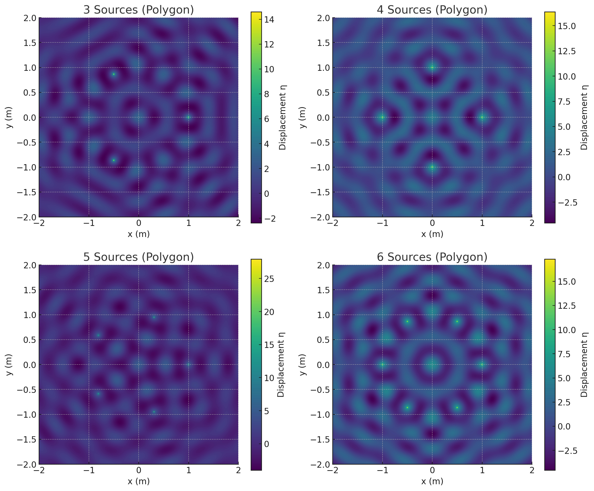

# Problem 1

## 1. Theoretical Foundation

When multiple circular waves are emitted from different point sources on a water surface, they overlap and form complex **interference patterns**. These patterns are governed by:

- The **wave equation** for each point source,
- The **principle of superposition**.

---

### Single Source Wave Equation

A wave emitted by a point source located at \( (x_0, y_0) \) on the surface is given by:

\[
\eta(x, y, t) = \frac{A}{\sqrt{r}} \cdot \cos(kr - \omega t + \phi)
\]

where:  
- \( \eta(x, y, t) \) is the displacement of the water surface,  
- \( A \) is the amplitude,  
- \( r = \sqrt{(x - x_0)^2 + (y - y_0)^2} \) is the distance from the source to point \( (x, y) \),  
- \( k = \frac{2\pi}{\lambda} \) is the wave number,  
- \( \omega = 2\pi f \) is the angular frequency,  
- \( \phi \) is the initial phase of the wave.

We assume all waves are **monochromatic**, **coherent**, and **have identical amplitude, frequency, and phase**.

---

### Superposition of Waves

If we place \( N \) identical sources at different positions \( (x_i, y_i) \), the resulting displacement is the sum of displacements from each:

\[
\eta_{\text{sum}}(x, y, t) = \sum_{i=1}^{N} \eta_i(x, y, t)
\]

This leads to **constructive interference** when wave crests align, and **destructive interference** when crests and troughs cancel each other.

---

### Symmetry and Patterns

If the sources are placed at the **vertices of a regular polygon**, their symmetry will be reflected in the interference pattern:

- 3 sources → triangular symmetry.
- 4 sources → square symmetry.
- 5+ sources → complex radial patterns.

These symmetrical setups are useful for studying:

- Zones of maximum and minimum amplitude,
- Nodal lines (where waves cancel out),
- Phase alignment across space.

---

### Summary

| Concept                | Role                                                   |
|------------------------|--------------------------------------------------------|
| Point wave equation    | Describes wave from one source                        |
| Superposition          | Adds effects of all sources together                  |
| Interference pattern   | Emerges from wave overlap (constructive/destructive)  |
| Regular polygon layout | Introduces symmetry and periodicity to the system     |

> This theoretical base enables us to model and visualize wave interference patterns with clarity and control.

## 2. Polygon-Based Source Layout and Simulation Strategy

To analyze interference patterns from multiple sources, we arrange \( N \) identical wave sources at the **vertices of a regular polygon** (triangle, square, pentagon, etc.).

---

### 1. Positioning Sources on a Polygon

All sources are placed on a circle of radius \( R \) centered at the origin. The coordinates of each source \( (x_i, y_i) \) are:

\[
x_i = R \cdot \cos\left( \frac{2\pi i}{N} \right), \quad
y_i = R \cdot \sin\left( \frac{2\pi i}{N} \right), \quad i = 0, 1, \dots, N-1
\]

This ensures perfect rotational symmetry.

---

### 2. Grid of Observation Points

We define a 2D grid of points \( (x, y) \) over a square region containing the polygon. At each point, we compute the total displacement:

\[
\eta_{\text{sum}}(x, y, t) = \sum_{i=1}^{N} \frac{A}{\sqrt{r_i}} \cdot \cos(k r_i - \omega t)
\]

where \( r_i = \sqrt{(x - x_i)^2 + (y - y_i)^2} \) is the distance from each source to the grid point.

---

### 3. Simulation Parameters

You can vary:

| Parameter      | Effect                                      |
|----------------|---------------------------------------------|
| \( N \)         | Number of sources (symmetry of the pattern) |
| \( R \)         | Radius of the source circle                 |
| \( \lambda \)   | Wavelength of the wave                      |
| \( f \)         | Frequency                                  |
| \( A \)         | Amplitude (optional: normalize to 1)        |
| Grid size       | Resolution of the visualization             |

---

### 4. Visualization

- Use a **2D color map** to display the resulting wave amplitude or intensity at each point.
- Choose either:
    - Snapshot in time (e.g., fixed \( t = 0 \))
    - Animated sequence for evolving interference

---

### Summary

| Step                        | Description                                             |
|-----------------------------|---------------------------------------------------------|
| Generate \( N \) source positions | Based on regular polygon around center              |
| Compute wave contribution  | At each point, from each source                        |
| Apply superposition        | Sum wave amplitudes (or intensities)                   |
| Visualize pattern          | Use color maps to show constructive/destructive regions |

> This strategy creates the foundation for generating visually rich and physically accurate wave interference simulations.

## 3. Python Simulation & Plotting

We simulate the interference pattern by computing the superposition of waves from multiple point sources over a 2D grid.

The code below supports:  
- Configurable number of sources,  
- Adjustable polygon radius, wavelength, and frequency,  
- Static snapshot visualization using a 2D color map.



---

### Python Code

```python
import numpy as np
import matplotlib.pyplot as plt

# Parameters
N = 5                  # Number of wave sources (e.g., 3=triangle, 4=square, 5=pentagon)
R = 1.0                # Radius of the polygon (in meters)
A = 1.0                # Wave amplitude
lam = 0.5              # Wavelength (meters)
f = 1.0                # Frequency (Hz)
omega = 2 * np.pi * f
k = 2 * np.pi / lam
t = 0                  # Snapshot time (seconds)

# Grid for visualization
grid_size = 500
x = np.linspace(-2, 2, grid_size)
y = np.linspace(-2, 2, grid_size)
X, Y = np.meshgrid(x, y)
eta_total = np.zeros_like(X)

# Generate source positions in regular polygon
source_coords = [
    (R * np.cos(2 * np.pi * i / N), R * np.sin(2 * np.pi * i / N))
    for i in range(N)
]

# Compute superposition of waves
for (x0, y0) in source_coords:
    r = np.sqrt((X - x0)**2 + (Y - y0)**2) + 1e-6  # avoid division by 0
    eta = (A / np.sqrt(r)) * np.cos(k * r - omega * t)
    eta_total += eta

# Visualization
plt.figure(figsize=(7, 6))
plt.imshow(eta_total, extent=[-2, 2, -2, 2], cmap='viridis', origin='lower')
plt.colorbar(label='Displacement η(x, y, t)')
plt.title(f'Interference Pattern: {N} Sources on Polygon')
plt.xlabel('x (m)')
plt.ylabel('y (m)')
plt.axis('equal')
plt.tight_layout()
plt.show()
```

---

### How to Use

Change these values to explore:

| Parameter | Role |
|-----------|------|
| `N`       | Number of sources (polygon type) |
| `R`       | Polygon size (radius) |
| `lam`     | Wavelength — controls spacing of fringes |
| `f`       | Frequency — affects animation if implemented |
| `t`       | Time snapshot — static or animated |

---

### What This Shows

- **Bright regions**: constructive interference (amplified waves)
- **Dark regions**: destructive interference (cancellation)
- **Fringes**: result of path differences between wave sources

> You can extend this model to animations or interactive sliders using `ipywidgets` or `matplotlib.animation`.

## 4. Analysis and Interpretation

The generated interference pattern reveals how waves interact based on their relative phase and source geometry.

---

### Key Features in the Pattern

#### ➕ Constructive Interference

Occurs where waves from different sources arrive **in phase**, reinforcing each other:

- Appears as **bright or elevated regions**.
- Found along symmetry lines from source to center.
- Distance differences between sources equal to \( n \lambda \), where \( n \in \mathbb{Z} \).

#### ➖ Destructive Interference

Occurs where waves arrive **out of phase**, cancelling each other:

- Appears as **dark regions or nodes**.
- Wave amplitudes subtract and reduce the total displacement.
- Happens when path difference equals \( (n + \frac{1}{2})\lambda \).

---

### Symmetry and Geometry

- The **rotational symmetry** of the polygon is reflected in the interference pattern.
  - Triangle → 3-fold symmetry.
  - Square → 4-fold.
  - Pentagon → 5-fold radial patterns.
- The **number of radial arms** or nodal lines increases with the number of sources.

---

### Physical Interpretation

| Feature | Physical Meaning |
|--------|------------------|
| Sharp bright peaks | Regions of high coherence, where waves align perfectly |
| Concentric rings | Result from uniform distance differences between pairs of sources |
| Nodal lines | Boundaries between constructive and destructive zones |
| Complexity increases with \( N \) | More interference paths, richer structure |

---

### Applications

This analysis is analogous to:

- **Water tank experiments** (real-life lab visuals)
- **Optical interference** (e.g., multiple-slit diffraction)
- **Acoustic systems** (speaker arrays, architectural acoustics)
- **Quantum wavefunctions** (interference in probability amplitudes)

---

> Interference patterns visually encode phase relationships and wave dynamics. By adjusting the number and arrangement of sources, we can design patterns with desired symmetry or cancellation zones — with applications from physics education to antenna design.
