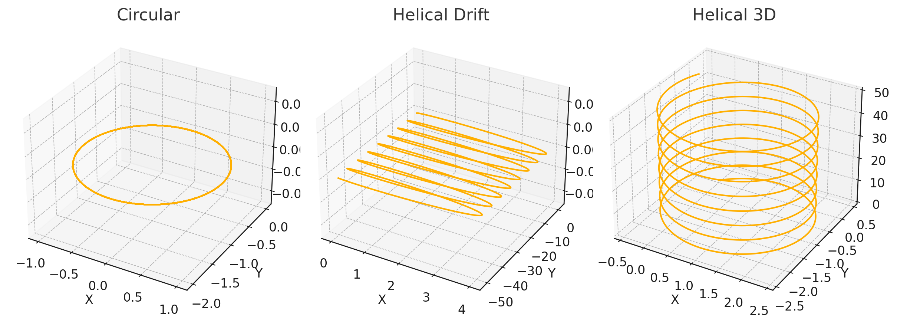
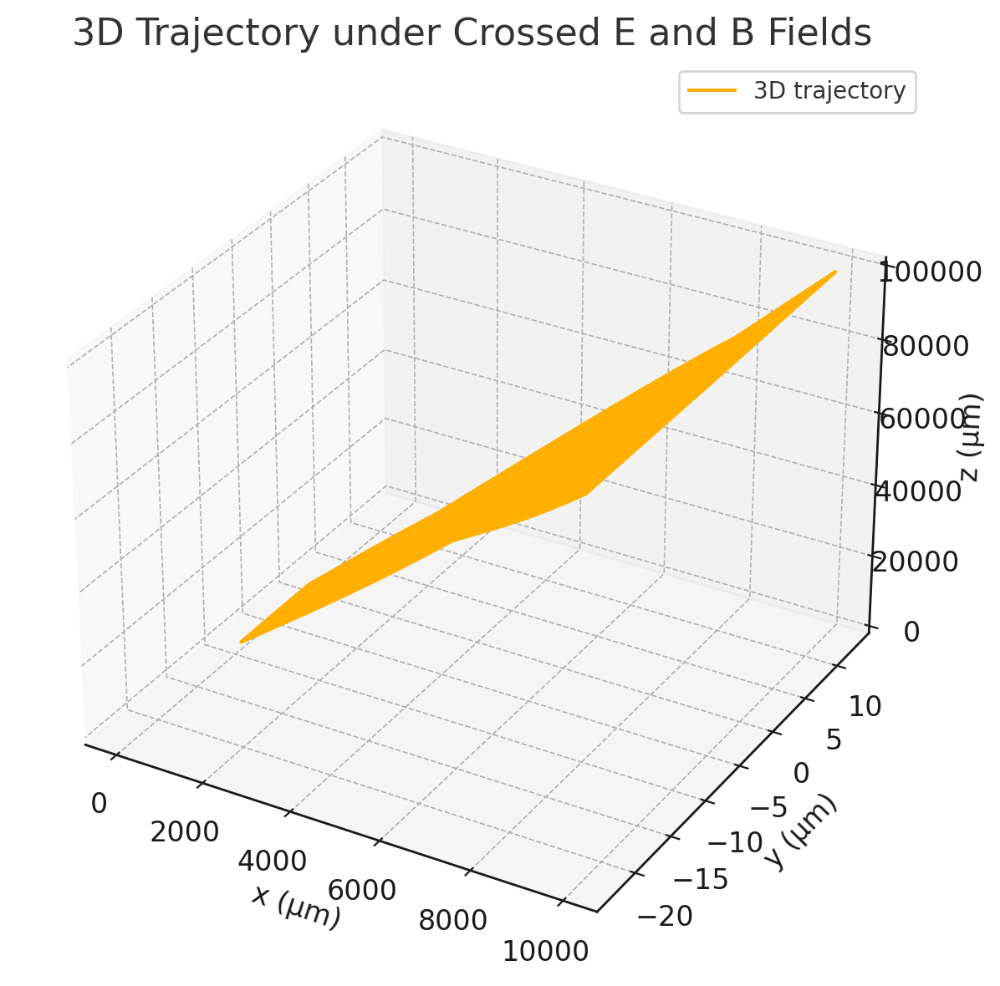
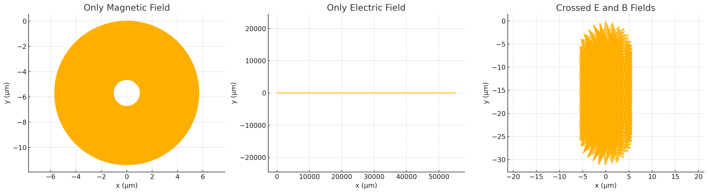
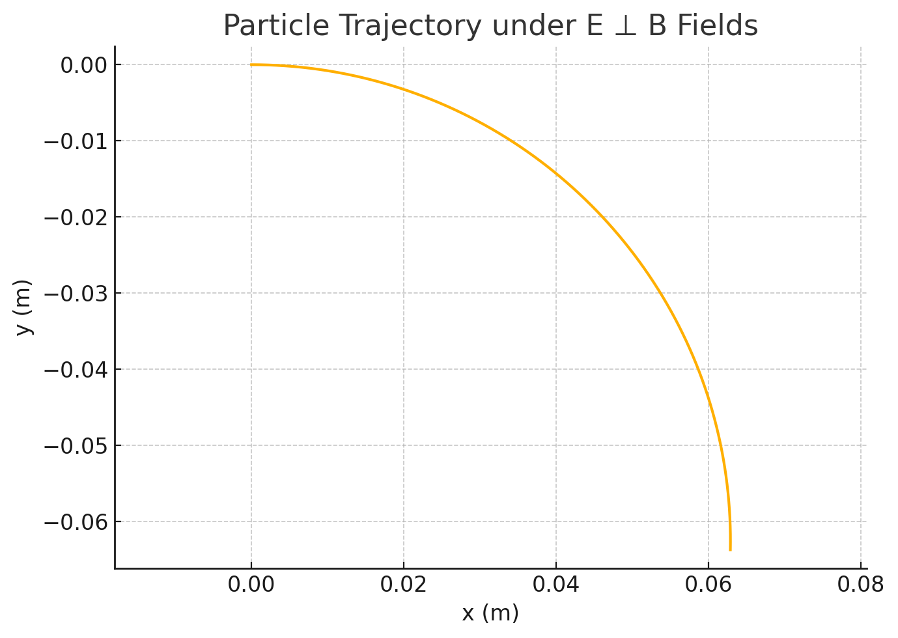
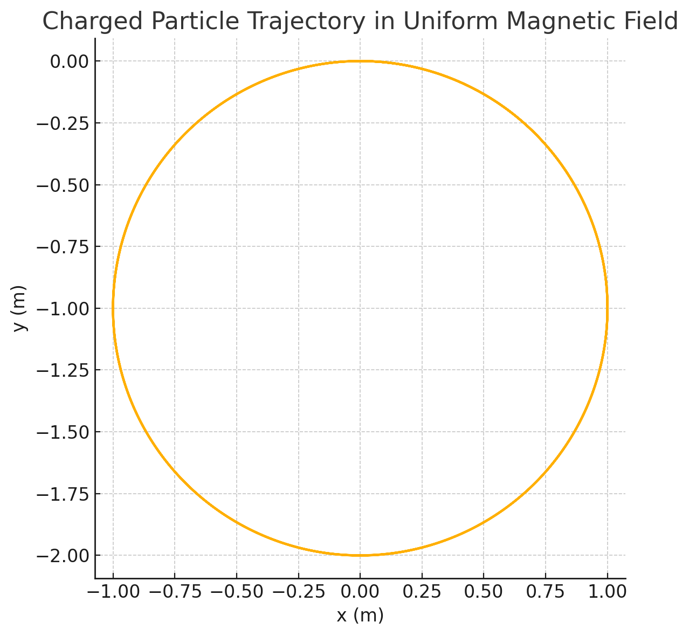
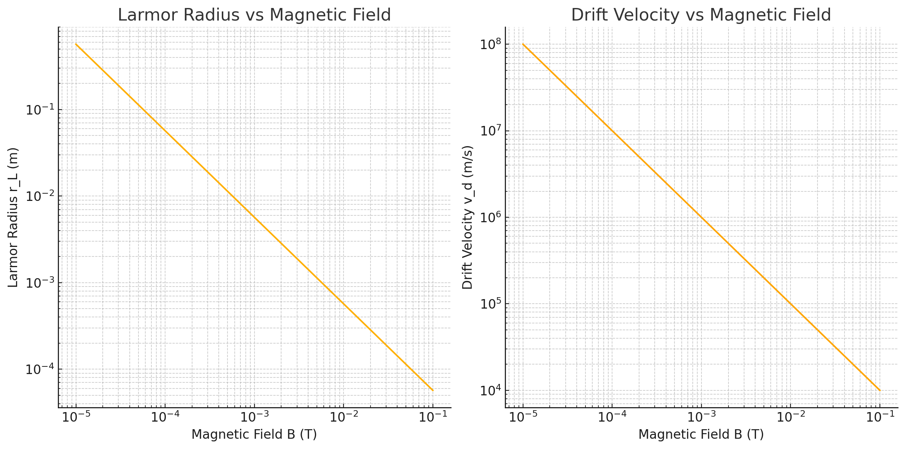
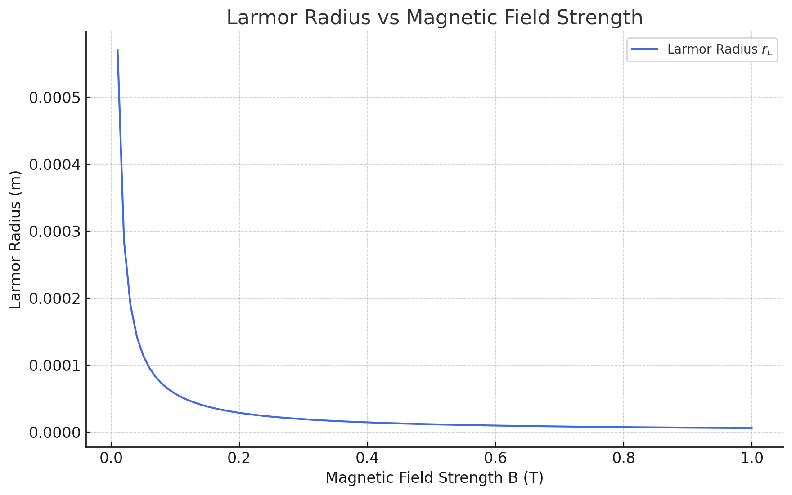
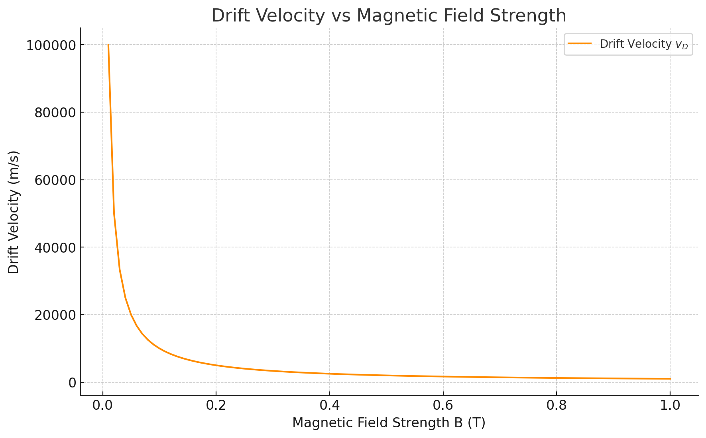

# Problem 1

## 1. Circular and Helical Trajectories
These plots demonstrate how a charged particle moves in a magnetic field:

- **Circular motion** when velocity is perpendicular to **B**.
- **Helical motion** when velocity has a component along **B**.
- **Helical drift** when combined with electric field.

---

## 2. 3D Trajectory under Crossed Fields
This plot shows the full 3D trajectory of a particle in crossed **E** and **B** fields.

---

## 3. Trajectories under B, E, and E×B

Three different configurations are compared:

- Only magnetic field (circular)  
- Only electric field (linear)  
- Both fields (drift)

---

## 4. Particle Drift under E ⊥ B
This 2D plot shows the particle path under perpendicular electric and magnetic fields.

---

## 5. Circular Trajectory in Uniform Magnetic Field
A clear circular path is formed due to Lorentz force.

---

## 6. Larmor Radius and Drift Velocity (Log-Scale)

These plots illustrate:
- Left: Larmor radius shrinking as **B** increases.  
- Right: Drift velocity dropping with increasing **B**.

---

## 7. Larmor Radius vs Magnetic Field (Linear Scale)
Illustrates how Larmor radius behaves in low- to high-**B** regions.

---

## 8. Drift Velocity vs Magnetic Field (Linear Scale)
Shows the relationship between drift velocity and magnetic field strength.

