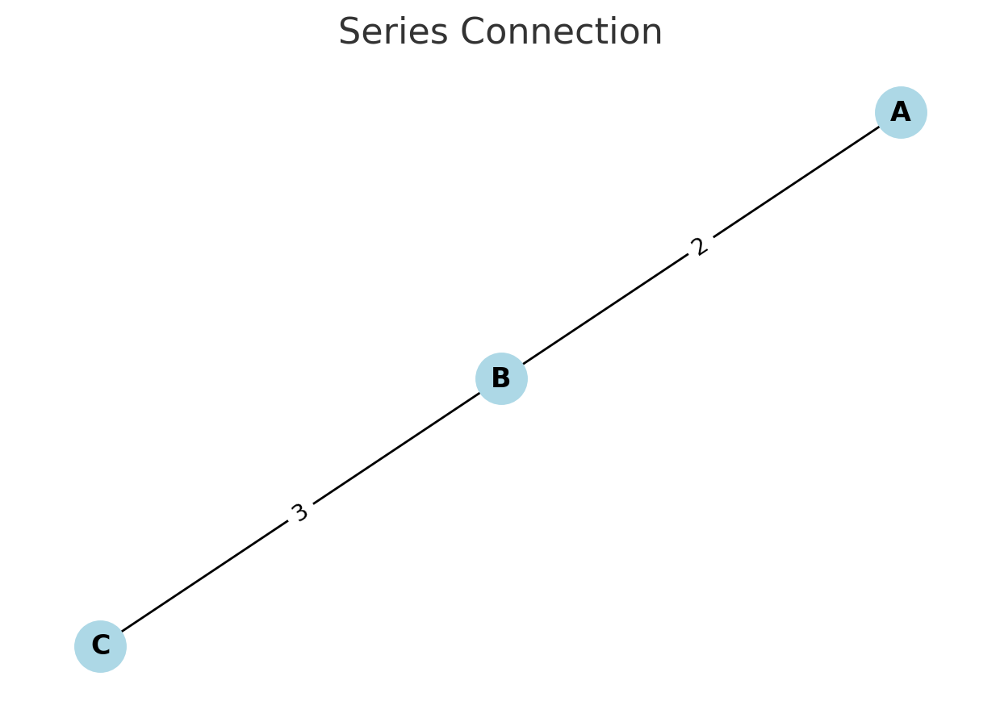
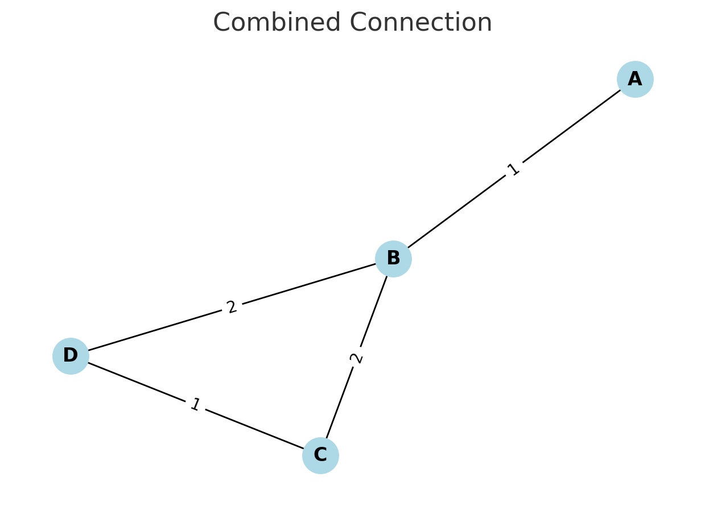
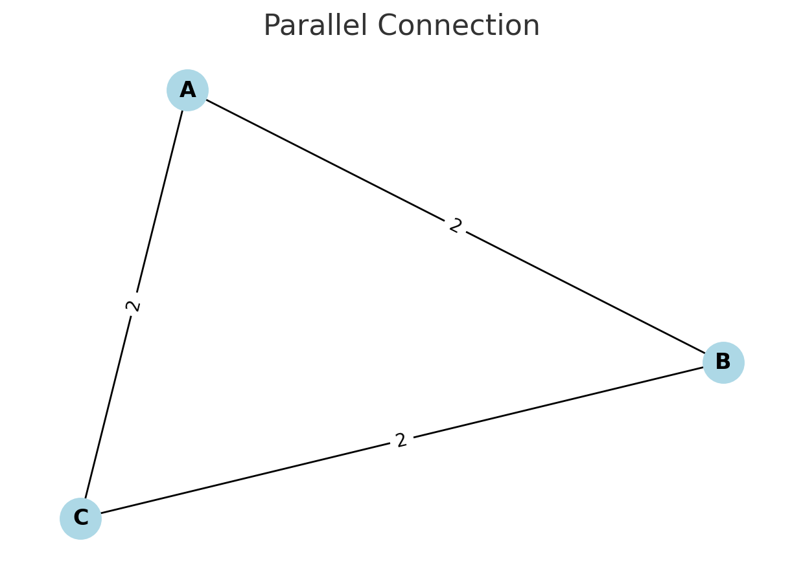

## Problem 1

### Motivation

Calculating the equivalent resistance is a fundamental task in electrical circuits. While manual methods like series-parallel reduction work for small circuits, they become impractical for complex networks. Graph theory offers a powerful and systematic alternative.

By modeling the circuit as a graph:

- **Nodes** represent junctions.
- **Edges** represent resistors, with edge weights as resistance values.

We can iteratively reduce the graph until only a single equivalent resistance remains between the input and output nodes.

---

### Algorithm Overview

1. **Input**: A weighted graph representing the circuit.

2. **Repeat** until no further simplification is possible:

   - **Parallel reduction**: If multiple edges exist between two nodes, replace them with a single edge using:

     $$ R_{\text{eq}} = \left( \sum_i \frac{1}{R_i} \right)^{-1} $$

   - **Series reduction**: If a node connects to exactly two others (and is not input/output), merge it using:

     $$ R_{\text{eq}} = R_1 + R_2 $$

3. **Output**: The final resistance between the input and output node.

---

### Pseudocode

```python
function calculate_equivalent_resistance(graph):
    while graph can be simplified:
        for each pair of nodes (u, v):
            if multiple edges exist between (u, v):  # Parallel
                R_parallel = 1 / sum(1 / R for each edge between u and v)
                remove all edges between u and v
                add edge (u, v) with R_parallel

        for each node n in graph:
            if degree(n) == 2 and n is not input/output:  # Series
                neighbors = [a, b]
                R1 = resistance between a and n
                R2 = resistance between n and b
                R_total = R1 + R2
                remove node n and its edges
                add edge (a, b) with R_total

    return resistance of the only remaining edge
```

---

### Test Examples

**1. Series connection**  

- Nodes: A — B — C  
- Edges: A–B: 2Ω, B–C: 3Ω  

Expected result:

$$
R_{\text{eq}} = 2 + 3 = 5\ \Omega
$$

---

**2. Parallel connection**  

- Nodes: A, B  
- Edges: A–B: 4Ω, A–B: 6Ω  

Expected result:

$$
R_{\text{eq}} = \left( \frac{1}{4} + \frac{1}{6} \right)^{-1} = 2.4\ \Omega
$$

---

**3. Nested configuration**  

- A–B: 2Ω  
- B–C: 4Ω, 4Ω (parallel)  
- C–D: 1Ω  

Reduction steps:
- B–C in parallel → 2Ω  
- A–B–C–D in series → 2Ω + 2Ω + 1Ω = 5Ω

---

### Advantages of Graph-Based Approach

- Works for arbitrary topologies  
- Suitable for automation with tools like Python and `networkx`  
- Efficient for large, nested, or cyclic circuits

---

### Conclusion

Using graph theory to calculate equivalent resistance simplifies and generalizes the process. It enables automated reasoning, handles arbitrary complexity, and lays the foundation for scalable simulation tools in physics, electrical engineering, and computer science.

---