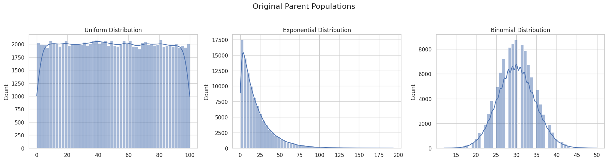
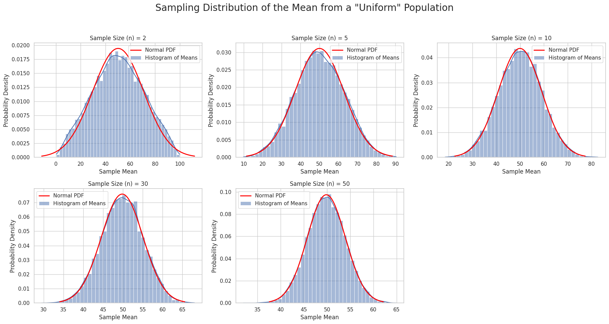
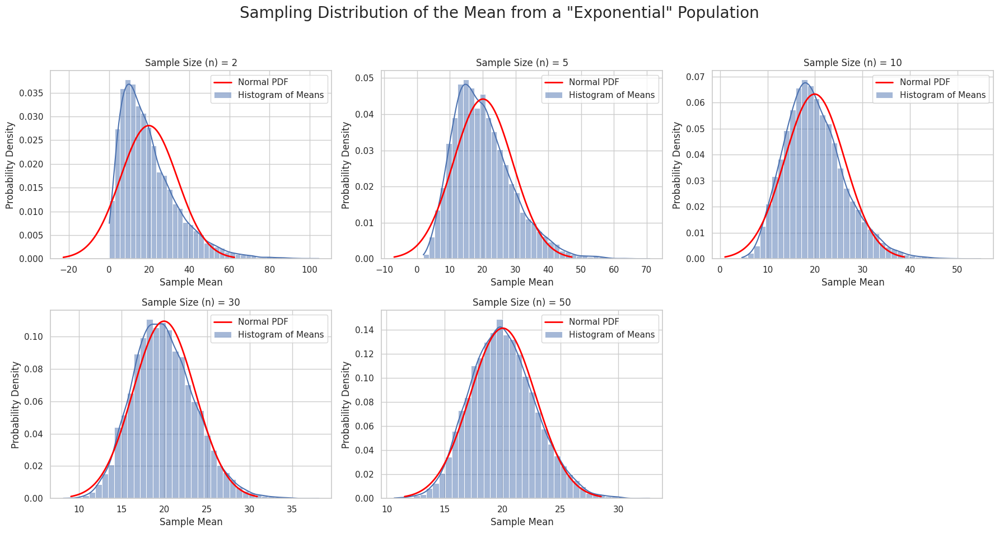
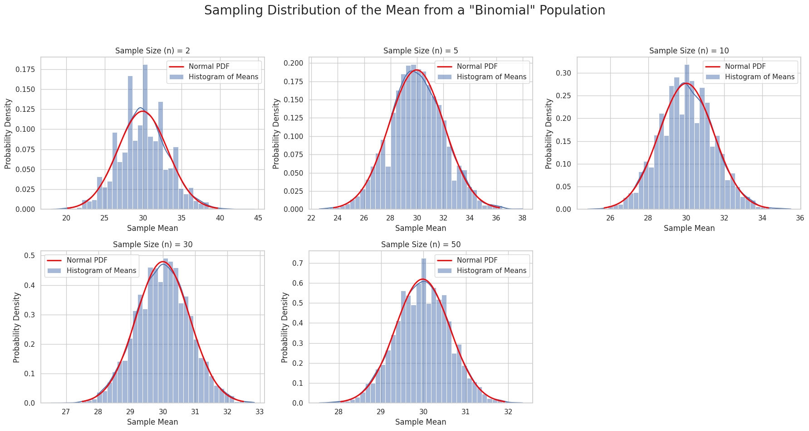

# Problem 1

The Central Limit Theorem (CLT) is a cornerstone of probability theory and statistics. It states that the sampling distribution of the sample mean from any population approaches a normal (Gaussian) distribution as the sample size increases, regardless of the shape of the original population's distribution.

Simulations provide an intuitive and hands-on way to observe this phenomenon in action.

### Motivation

The main goal is to demonstrate how the distribution of sample means, taken from various types of distributions (even those far from normal), converges to a normal distribution as the sample size increases.

### Task

1.  **Simulating Parent Populations:** Create large datasets representing populations with uniform, exponential, and binomial distributions.
2.  **Sampling and Visualization:**
      * Randomly draw samples of different sizes (e.g., 2, 5, 10, 30, 50).
      * For each sample size, repeat the process many times, calculating the mean for each sample to create a *sampling distribution of the sample mean*.
      * Plot histograms of these distributions and observe their convergence to normality.
3.  **Parameter Exploration:** Analyze how the shape of the original distribution and the sample size influence the rate of convergence.
4.  **Practical Applications:** Discuss the importance of the CLT in real-world problems.

-----

## Python Implementation and Analysis

To accomplish this task, we will use Python libraries: `NumPy` for numerical operations and random number generation, `Matplotlib` and `Seaborn` for visualization. `SciPy` will be used to overlay the ideal normal distribution curve on our histograms.

### Step 1: Creating the Parent Populations

First, we will generate three large parent populations to simulate different types of distributions. The size of each population is 100,000 observations.

```python
import numpy as np
import matplotlib.pyplot as plt
import seaborn as sns
from scipy import stats

# Set the theme for the plots
sns.set_theme(style="whitegrid")

# Define the size of the parent population
population_size = 100000

# 1. Uniform distribution
# All values between 0 and 100 have an equal probability.
uniform_pop = np.random.uniform(0, 100, population_size)

# 2. Exponential distribution
# Heavily skewed to the right. Often used to model the time until an event occurs.
exponential_pop = np.random.exponential(scale=20, size=population_size) # scale = mean

# 3. Binomial distribution
# A discrete distribution. Models the number of "successes" in n independent trials.
# For example, 100 coin flips with a probability of heads p=0.3.
binomial_pop = np.random.binomial(n=100, p=0.3, size=population_size)

# Visualize the original populations
fig, axes = plt.subplots(1, 3, figsize=(18, 5))
fig.suptitle('Original Parent Populations', fontsize=16)

sns.histplot(uniform_pop, bins=50, ax=axes[0], kde=True).set_title('Uniform Distribution')
sns.histplot(exponential_pop, bins=50, ax=axes[1], kde=True).set_title('Exponential Distribution')
sns.histplot(binomial_pop, bins=50, ax=axes[2], kde=True).set_title('Binomial Distribution')

plt.tight_layout(rect=[0, 0.03, 1, 0.95])
plt.show()
```

**Result (Plots):**



The output plots will show:  
1. A flat, rectangular distribution for the uniform data;  
2. A heavily right-skewed distribution for the exponential data;  
3. A discrete, somewhat bell-shaped but not perfectly symmetric distribution for the binomial data.

### Step 2: Sampling and Visualization

Now, we will write a function that takes a given population, repeatedly draws samples of a specific size, calculates their means, and plots a histogram of these means.

```python
def plot_sampling_distributions(population, pop_name, sample_sizes, num_samples=10000):
    """
    A function to simulate and visualize sampling distributions of the sample mean.
    
    :param population: The original parent population.
    :param pop_name: The name of the distribution for titles.
    :param sample_sizes: A list of sample sizes to investigate.
    :param num_samples: The number of samples to generate for each size.
    """
    fig, axes = plt.subplots(2, 3, figsize=(18, 10))
    fig.suptitle(f'Sampling Distribution of the Mean from a "{pop_name}" Population', fontsize=20)
    
    # Flatten the axes array for easy iteration
    axes = axes.flatten()

    for i, n in enumerate(sample_sizes):
        ax = axes[i]
        
        # Generate `num_samples` sample means
        sample_means = [np.mean(np.random.choice(population, size=n)) for _ in range(num_samples)]
        
        # Plot the histogram and KDE
        sns.histplot(sample_means, bins=40, kde=True, stat="density", ax=ax, label='Histogram of Means')
        
        # Overlay the ideal normal curve for comparison
        mu, std = np.mean(sample_means), np.std(sample_means)
        x = np.linspace(mu - 3*std, mu + 3*std, 100)
        ax.plot(x, stats.norm.pdf(x, mu, std), color='red', lw=2, label='Normal PDF')
        
        ax.set_title(f'Sample Size (n) = {n}')
        ax.set_xlabel('Sample Mean')
        ax.set_ylabel('Probability Density')
        ax.legend()

    # Hide any unused subplots
    for i in range(len(sample_sizes), len(axes)):
        fig.delaxes(axes[i])
        
    plt.tight_layout(rect=[0, 0.03, 1, 0.95])
    plt.show()

# Define the sample sizes to test
sample_sizes_to_test = [2, 5, 10, 30, 50]

# Run the simulation for each distribution type
plot_sampling_distributions(uniform_pop, "Uniform", sample_sizes_to_test)
plot_sampling_distributions(exponential_pop, "Exponential", sample_sizes_to_test)
plot_sampling_distributions(binomial_pop, "Binomial", sample_sizes_to_test)
```

**Results (Plots):**



  * **For the Uniform Distribution:** As early as `n=5`, the distribution of means begins to resemble a bell curve. By `n=30`, it is practically indistinguishable from a normal distribution.



  * **For the Exponential Distribution:** At `n=2` or `n=5`, the distribution of means is still noticeably skewed to the right. However, by `n=30` and `n=50`, it becomes almost symmetric and is well-described by the normal curve. This shows that more heavily skewed original distributions require a larger sample size to converge.



  * **For the Binomial Distribution:** Convergence happens very quickly, as the original distribution was already somewhat symmetric.

### Step 3: Parameter Exploration and Discussion

#### Influence of the Original Distribution's Shape

As the simulations showed, the rate of convergence to normality depends on the symmetry of the parent distribution.

  * **Symmetric distributions (e.g., uniform):** Converge very quickly.
  * **Heavily skewed distributions (e.g., exponential):** Require a significantly larger sample size (`n`) for the sampling distribution of the mean to become symmetric and bell-shaped.

#### Influence of Sample Size ($n$)

This is the central element of the CLT. Regardless of the original shape, **as the sample size $n$ increases**:

1.  **The sampling distribution of the mean gets closer to a normal distribution.** A common rule of thumb is that `n ≥ 30` is often sufficient, but as we saw, more may be needed for heavily skewed data.
2.  **The spread (variance) of the sampling distribution decreases.**

#### Influence of Population Variance ($\\sigma^2$)

The theorem also tells us something important about variance. If the original population has a mean $\\mu$ and a standard deviation $\\sigma$, then the sampling distribution of the mean will have:

  * A mean: $\\mu\_{\\bar{x}} = \\mu$
  * A standard deviation (called the **standard error of the mean**): $\\sigma\_{\\bar{x}} = \\frac{\\sigma}{\\sqrt{n}}$

The variance of the sampling distribution is therefore $\\sigma\_{\\bar{x}}^2 = \\frac{\\sigma^2}{n}$.

This formula mathematically confirms what we see in the plots: the larger the sample size $n$, the smaller the standard error, and the "narrower" and "taller" the histogram of sample means becomes. This means that the average of a large sample is highly likely to be close to the true population mean.

-----

### Step 4: Practical Applications of the CLT

The Central Limit Theorem is incredibly important because it allows us to make inferences about population parameters (like the mean) even if we don't know the population's distribution.

1.  **Estimating Population Parameters:** The CLT is the foundation for constructing **confidence intervals** for the mean. We can take a single, sufficiently large sample, calculate its mean, and use the properties of the normal distribution to estimate a range where the true population mean lies with a certain level of confidence.

2.  **Quality Control in Manufacturing:** In factories, product parameters (e.g., weight, length of a part) are measured. Small samples are taken at regular intervals, and their means are plotted on control charts. Thanks to the CLT, these means should behave predictably (fall within limits calculated based on the normal distribution). If a sample mean falls outside these limits, it signals a potential problem in the production process.

3.  **Forecasting in Financial Models:** The returns on assets are often the result of many small, independent events. The sum or average of these effects, according to the CLT, can be approximated by a normal distribution, which simplifies risk modeling and forecasting.

### Conclusion

Through simulations, we have visually demonstrated the power of the Central Limit Theorem. We observed how sampling distributions of the mean, drawn from populations with vastly different shapes, inevitably converge toward a normal distribution as the sample size grows. This property makes the CLT a powerful tool for analysts, engineers, and scientists, enabling them to apply methods of statistical inference to a wide variety of practical problems.