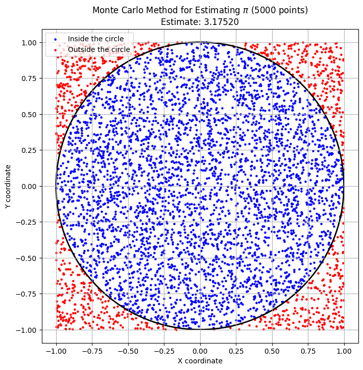
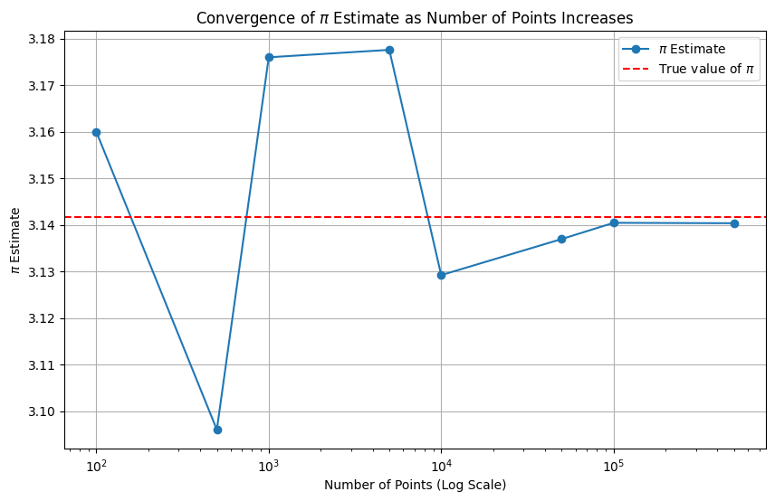
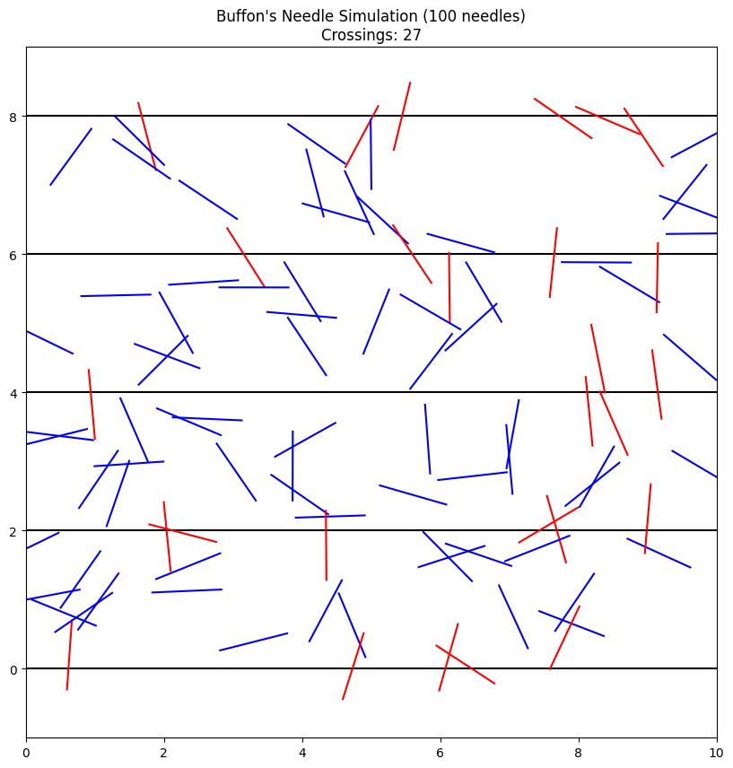
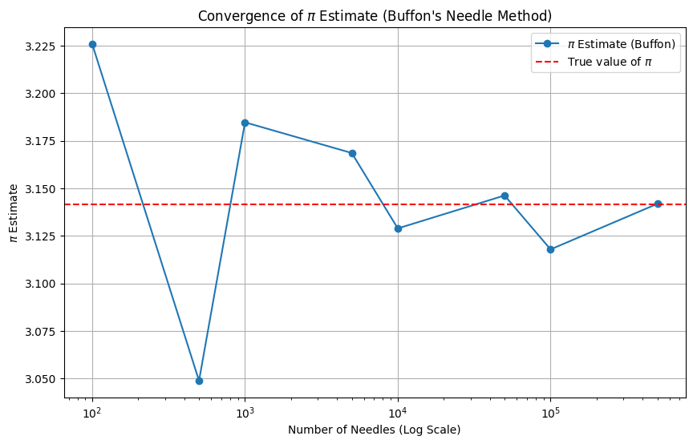

# Problem 2

Monte Carlo methods are a powerful class of computational algorithms that rely on repeated random sampling to obtain numerical results. One of the most elegant applications of this approach is estimating the value of $\pi$. In this problem, we will explore two famous methods.

---

## Part 1: Estimating $\pi$ using a Circle

This method is based on a simple geometric relationship. If we randomly "throw darts" at a square with a circle inscribed in it, the ratio of the number of darts that land inside the circle to the total number of darts thrown will be approximately equal to the ratio of the circle's area to the square's area.

### 1. Theoretical Foundation

1.  Consider a circle with radius $r$ inscribed within a square with a side length of $2r$.
2.  The area of the circle is: $A_{circle} = \pi r^2$.
3.  The area of the square is: $A_{square} = (2r)^2 = 4r^2$.
4.  The probability ($P$) that a randomly chosen point inside the square will also be inside the circle is the ratio of their areas:
    $$P = \frac{A_{circle}}{A_{square}} = \frac{\pi r^2}{4r^2} = \frac{\pi}{4}$
5.  In a simulation, we can estimate this probability as the ratio of points that landed inside the circle to the total number of points:
    $P \approx \frac{\text{points inside circle}}{\text{total points}}$
6.  By combining these two expressions, we get a formula to estimate $\pi$:
    $\frac{\pi}{4} \approx \frac{\text{points inside circle}}{\text{total points}} \implies \pi \approx 4 \cdot \frac{\text{points inside circle}}{\text{total points}}$

For simplicity, we will use a square with sides from -1 to 1 and an inscribed unit circle (radius $r=1$).

### 2. Simulation and Visualization

We will generate a large number of random points $(x, y)$ within the square $[-1, 1] \times [-1, 1]$. A point is inside the unit circle if the condition $x^2 + y^2 \leq 1$ is met.

```python
import numpy as np
import matplotlib.pyplot as plt
import math

def estimate_pi_circle(num_points):
    """
    Estimates Pi using the Monte Carlo method with a circle and a square.
    Returns the Pi estimate and the coordinates of the points for visualization.
    """
    # Generate random points in the square [-1, 1] x [-1, 1]
    x = np.random.uniform(-1, 1, num_points)
    y = np.random.uniform(-1, 1, num_points)
    
    # Calculate the distance from the center (0,0)
    distance_from_center = x**2 + y**2
    
    # Find the points that are inside or on the circle's boundary
    points_inside = np.sum(distance_from_center <= 1)
    
    # Estimate Pi
    pi_estimate = 4 * points_inside / num_points
    
    return pi_estimate, x, y, distance_from_center

# --- Simulation and Visualization ---
num_points_for_plot = 5000
pi_val, x_coords, y_coords, dist = estimate_pi_circle(num_points_for_plot)

# Separate points into inside and outside for coloring
inside_mask = dist <= 1
outside_mask = dist > 1

plt.figure(figsize=(8, 8))
plt.scatter(x_coords[inside_mask], y_coords[inside_mask], color='blue', s=5, label='Inside the circle')
plt.scatter(x_coords[outside_mask], y_coords[outside_mask], color='red', s=5, label='Outside the circle')

# Draw the circle's outline
circle = plt.Circle((0, 0), 1, color='black', fill=False, linewidth=2)
plt.gca().add_artist(circle)

plt.title(f'Monte Carlo Method for Estimating $\pi$ ({num_points_for_plot} points)\nEstimate: {pi_val:.5f}')
plt.xlabel('X coordinate')
plt.ylabel('Y coordinate')
plt.legend()
plt.axis('equal')
plt.grid(True)
plt.show()
```

**Graphical Output:**



The plot will show a square filled with points. Points that landed inside the circle will be blue, while those in the corners of the square will be red. A black circle clearly marks the boundary.

### 3. Convergence Analysis

Now, let's investigate how the accuracy of the estimate depends on the number of points.

```python
# --- Convergence Analysis ---
point_counts = [100, 500, 1000, 5000, 10000, 50000, 100000, 500000]
pi_estimates = []

for n in point_counts:
    estimate, _, _, _ = estimate_pi_circle(n)
    pi_estimates.append(estimate)

plt.figure(figsize=(10, 6))
plt.plot(point_counts, pi_estimates, marker='o', linestyle='-', label='$\pi$ Estimate')
plt.axhline(y=math.pi, color='r', linestyle='--', label='True value of $\pi$')
plt.xscale('log') # Use a log scale for better visualization
plt.title('Convergence of $\pi$ Estimate as Number of Points Increases')
plt.xlabel('Number of Points (Log Scale)')
plt.ylabel('$\pi$ Estimate')
plt.grid(True)
plt.legend()
plt.show()

# Print a table with the results
print("Number of Points | Pi Estimate | Error")
print("-----------------|-------------|------------")
for n, est in zip(point_counts, pi_estimates):
    error = abs(est - math.pi)
    print(f"{n:<16} | {est:<11.6f} | {error:.6f}")
```

**Analysis:**



| Number of Points | Pi Estimate | Error |
|------------------|-------------|-------|
| 100              | 3.160000    | 0.018407 |
| 500              | 3.096000    | 0.045593 |
| 1000             | 3.176000    | 0.034407 |
| 5000             | 3.177600    | 0.036007 |
| 10000            | 3.129200    | 0.012393 |
| 50000            | 3.136960    | 0.004633 |
| 100000           | 3.140440    | 0.001153 |
| 500000           | 3.140352    | 0.001241 |

The convergence plot and table show that as the number of points increases, the estimate of $\pi$ gets closer to the true value. However, the convergence is quite slow: to gain an additional correct decimal place, the number of points needs to be increased by a factor of about 100. The error of a Monte Carlo method typically decreases in proportion to $1/\sqrt{N}$, where $N$ is the number of trials (points).

---

## Part 2: Estimating $\pi$ using Buffon's Needle

This is another classic Monte Carlo experiment, conceived in the 18th century. It involves dropping needles onto a plane ruled with parallel lines.

### 1. Theoretical Foundation

1.  Imagine a plane with parallel lines drawn at an equal distance $t$ from each other.
2.  A needle of length $l$ is randomly dropped onto this plane. To simplify the analysis, we consider the case where $l \leq t$ (the needle cannot cross more than one line at a time).
3.  The probability ($P$) that the needle will cross one of the lines is given by the formula:
    $P = \frac{2l}{\pi t}$
4.  As in the first method, we can estimate this probability from the experiment:
    $P \approx \frac{\text{number of crossings}}{\text{total number of drops}}$
5.  By equating the theoretical and experimental probabilities, we get a formula for $\pi$:
    $\frac{2l}{\pi t} \approx \frac{\text{number of crossings}}{\text{total number of drops}} \implies \pi \approx \frac{2l \cdot (\text{total number of drops})}{t \cdot (\text{number of crossings})}$

### 2. Simulation and Visualization

We will simulate the needle drops. For each drop, we need to determine two random variables: the position of the needle's center and its angle. Due to the problem's symmetry, it's sufficient to consider the position of the center relative to the nearest line and an angle in the range of $0$ to $\pi/2$.

```python
import random

def estimate_pi_buffon(num_needles, needle_length, line_dist):
    """
    Estimates Pi using the Buffon's Needle method.
    """
    # Simplify by assuming l <= t
    if needle_length > line_dist:
        raise ValueError("Needle length (l) cannot be greater than the distance between lines (t).")

    crossings = 0

    for _ in range(num_needles):
        # Distance from the needle's center to the nearest line (range from 0 to t/2)
        dist_to_line = random.uniform(0, line_dist / 2)
        # Angle of the needle (range from 0 to pi/2)
        angle = random.uniform(0, math.pi / 2)

        # Projection of half the needle's length onto the vertical axis
        projection = (needle_length / 2) * math.sin(angle)

        # If the distance to the line is less than the projection, the needle crosses it
        if dist_to_line <= projection:
            crossings += 1

    # Prevent division by zero if there are no crossings
    if crossings == 0:
        return float('inf') # Return infinity as an error signal

    pi_estimate = (2 * needle_length * num_needles) / (line_dist * crossings)
    return pi_estimate

# --- Visualization for a small number of needles ---
num_needles_for_plot = 100
l, t = 1, 2 # l = needle length, t = distance between lines

plt.figure(figsize=(10, 10))
# Draw parallel lines
for i in range(5):
    plt.axhline(y=i*t, color='black')

# Drop and visualize the needles
cross_count_viz = 0
for _ in range(num_needles_for_plot):
    # Random position for the needle's center
    center_x = random.uniform(0, 10)
    center_y = random.uniform(0, 8)
    angle = random.uniform(0, math.pi) # Full range for aesthetics

    # Coordinates of the needle's endpoints
    end_x1 = center_x - (l/2) * math.cos(angle)
    end_y1 = center_y - (l/2) * math.sin(angle)
    end_x2 = center_x + (l/2) * math.cos(angle)
    end_y2 = center_y + (l/2) * math.sin(angle)

    # Check for crossing
    line_below = math.floor(center_y / t) * t
    line_above = line_below + t

    color = 'blue'
    if end_y1 < line_below or end_y2 < line_below or end_y1 > line_above or end_y2 > line_above:
        color = 'red'
        cross_count_viz += 1

    plt.plot([end_x1, end_x2], [end_y1, end_y2], color=color)

plt.title(f"Buffon's Needle Simulation ({num_needles_for_plot} needles)\nCrossings: {cross_count_viz}")
plt.xlim(0, 10)
plt.ylim(-1, 9)
plt.gca().set_aspect('equal', adjustable='box')
plt.show()
```



### 3. Convergence Analysis

Similar to the first method, let's check the convergence of the estimate.

```python
# --- Convergence Analysis for Buffon's Needle ---
needle_counts = [100, 500, 1000, 5000, 10000, 50000, 100000, 500000]
pi_estimates_buffon = []

l, t = 1, 2 # Use the same parameters

for n in needle_counts:
    estimate = estimate_pi_buffon(n, l, t)
    pi_estimates_buffon.append(estimate)

plt.figure(figsize=(10, 6))
plt.plot(needle_counts, pi_estimates_buffon, marker='o', linestyle='-', label="$\pi$ Estimate (Buffon)")
plt.axhline(y=math.pi, color='r', linestyle='--', label='True value of $\pi$')
plt.xscale('log')
plt.title("Convergence of $\pi$ Estimate (Buffon's Needle Method)")
plt.xlabel('Number of Needles (Log Scale)')
plt.ylabel('$\pi$ Estimate')
plt.grid(True)
plt.legend()
plt.show()

# Print a table with the results
print("Number of Needles | Pi Estimate | Error")
print("------------------|-------------|------------")
for n, est in zip(needle_counts, pi_estimates_buffon):
    error = abs(est - math.pi)
    print(f"{n:<18} | {est:<11.6f} | {error:.6f}")
```



| Number of Needles | Pi Estimate | Error |
|-------------------|-------------|-------|
| 100               | 3.225806    | 0.084214 |
| 500               | 3.048780    | 0.092812 |
| 1000              | 3.184713    | 0.043121 |
| 5000              | 3.168568    | 0.026975 |
| 10000             | 3.128911    | 0.012682 |
| 50000             | 3.146237    | 0.004644 |
| 100000            | 3.117887    | 0.023705 |
| 500000            | 3.141848    | 0.000256 |

### 4. Comparison of Methods and Conclusion

**Convergence:** Both methods demonstrate convergence to the true value of $\pi$ as the number of trials increases. The rate of convergence in both cases is theoretically $O(1/\sqrt{N})$, which is characteristic of Monte Carlo methods.

**Efficiency:**

* **The Circle Method** is generally considered more "efficient" computationally. Each iteration requires generating two random numbers and one simple check. It is very straightforward to implement.
* **The Buffon's Needle Method** requires more calculations per iteration (including a trigonometric function, `sin`), which makes it slower. However, it has immense historical and pedagogical value.

**Conclusion:**
We have successfully implemented two classic Monte Carlo methods for estimating the value of $\pi$. Both approaches beautifully illustrate the core idea of using randomness to solve a deterministic problem. The circle method is more practical for a quick estimate, while the Buffon's Needle problem serves as a wonderful example of the connection between geometry and probability theory.